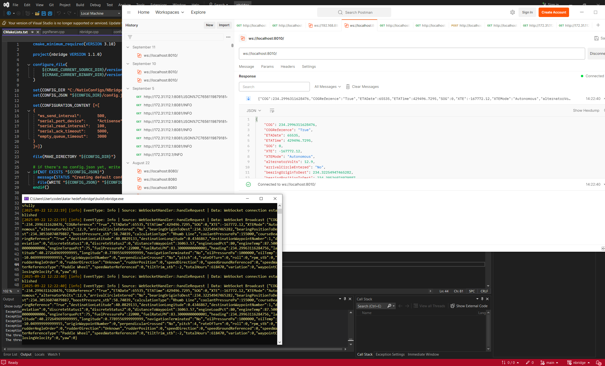

This repository showcases my practical work in developing real-time computer vision pipelines, and various perception system modules.

---

## 1. Real-Time 2D Localization & Sensor Fusion
Developed a perception system using **RGB cameras** to achieve accurate 2D localization. This project was deployed in interactive exhibition environments to track movement and provide real-time spatial data.
* **Tech Stack:** Python, OpenCV, YOLO

## 2. Laser Detection & Spatial Projection
Designed a pipeline to detect laser light sources in a 3D environment and project their coordinates onto a localized 2D canvas. This involved high-speed image processing to ensure seamless interaction between the physical laser and the digital projection.
* **Tech Stack:** Python, OpenCV, Image Processing

## 3. LiDAR Data Processing & Visualization
Worked with **LiDAR sensors** to process point cloud data for environmental awareness in interactive exhibition areas. This included noise filtering and spatial mapping to enable real-time visualization and user interaction.
* **Tech Stack:** C++, Qt

## 4. NMEA Data to WebSocket Server
Implemented a backend module to convert **NMEA 2000/CAN-bus** data from maritime sensors into a **WebSocket server**. This allowed for low-latency, real-time telemetry streaming to web-based dashboards and control interfaces for autonomous vessels.
* **Tech Stack:** C++, NMEA 2000, WebSockets

---